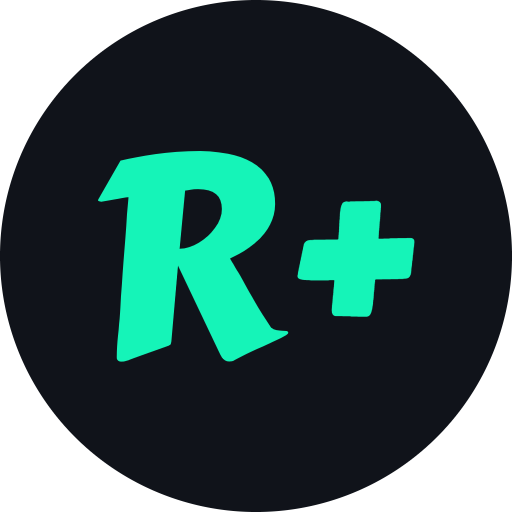
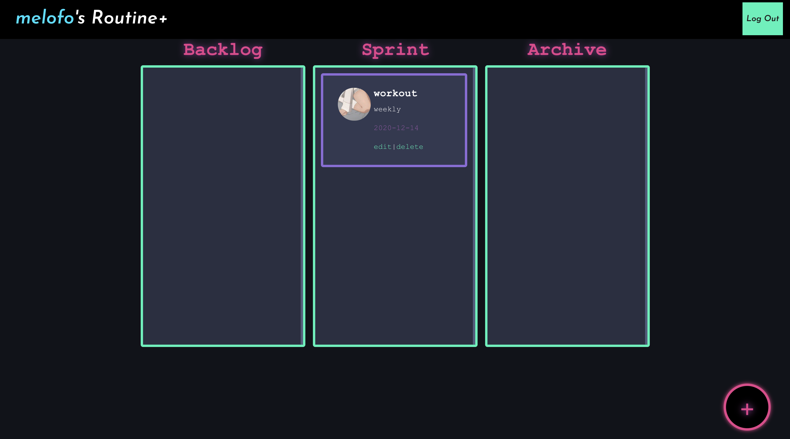
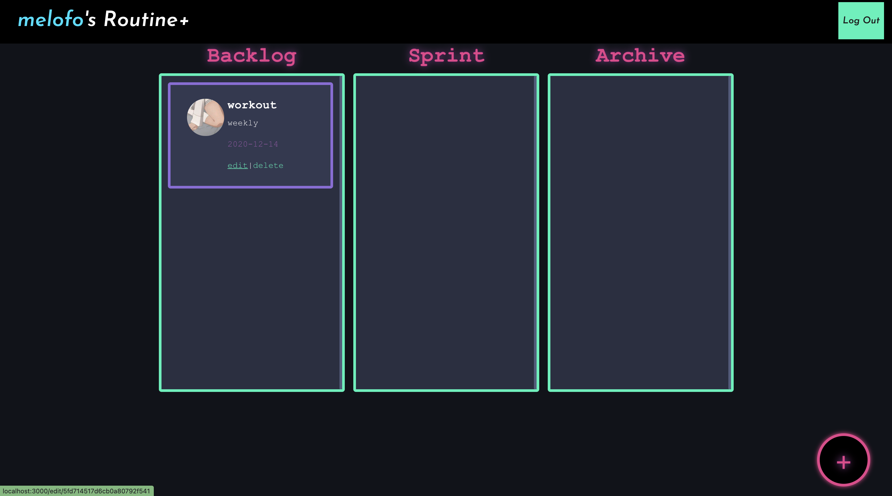

<h1 align="center">
   
  
   
  Routine+
  
   

</h1>
  <h3 align="center">Routine Plus. A Better You. Everyday</h3>

  <a href="#welcome-to-routine">Introduction</a> •
  <a href="#links">Links</a> •
  <a href="#software-development-process">Process</a> •
  <a href="#project-team">Project Team</a> •
  <a href="#features">Key Features</a> •
  <a href="#instructions">Instructions</a>
  <a href="#file-organization">File Organization</a>
  <a href="#set-up">Set Up</a>
  <a href="#how-to-run">How to Run</a>

| Directory | Description |
| --- | --- |
| docs/ | Project landing page, communications plan, APIs, requirements, design, architecture, test plan, team organization PDFs |
| routine-plus/ | Main codebase of the project |

## Welcome to Routine+
Routine+ is an online platform for individuals or teams to organize daily/weekly/monthly routines by creating task boards with different columns and dragging and dropping the tasks between them. It features a beautiful drag-and-drop UI to allow a user to seamlessly manage their Tasks.

The application is a full-stack service that is built using the MERN stack and external libraries such as axios, mongoose, and react-beautiful-rnd.

## Links
* [Routine+ Website](https://routine-plus.herokuapp.com/)
* [Project landing page](https://pages.github.ccs.neu.edu/2020FACS5500SV/project-routine-plus/)
  
## Software Development Process
* Agile

## Project Team

| Name | GitHub Handle |
| --- | --- | 
| Junfeng Zhou | zjf |
| Vy Thai | Thaivy| 
| Yuan Yao| melofo | 
| Wei Nien Chen | wtg30303 | 

## Features
* Sign up: create a new user
* Log in: log in an account
* Log out: log out an account
* Create: Create a new Routine
* Edit: Edit an existing Routine
* Delete: Delete a Routine
* Drag and drop Routine to any block as you see fit

## Instructions
* Routine Plus allows you to keep track of all the Routines you wish to integrate into your life style
* After you created a Routine, it could have a daily/weekly/monthly frequency, the Routine will appear in the "Sprint" block, awaiting to be completed
* Whenever you complete this Routine, drag and drop the Routine into the "Backlog" block
* Routine+ automatically moves the Routine to the "Sprint" block when the set frequency date range has been reached
* Drag your Routine to the "Archive" block whenever you are feel like breaking away from this Routine and want to keep it for records

<h5> A new Routine has been created witing to be completed</h5>

<h5> After working out, simply drag and rop the Routine to the Backlog block   and let the Routine+ do the rest!</h5>

<h5> Since this is a weekly routine, Routine+ will move it back to the "Spring" when it reached the 7th day</h5>

## File Organization
Repo  
* files(.gitignore etc.)     
* backend  
  * files(server.js etc.)  
  * middleware
    * auth files  
  * models  
    * model files  
  * routes  
    * route files  
* src  
  * files(App.js, App.css etc.)  
  * components  
    * component files  
* public  
  * index.html
  
## Set up
You’ll need to have Node 8.16.0 or Node 10.16.0 or later version on your local development machine (but it’s not required on the server). You can use nvm (macOS/Linux) or nvm-windows to switch Node versions between different projects.

## How to run
1. Clone project locally
2. Make sure you're in the root of the project (`routine-plus/`) where package.json is
3. `npm install`
4. `npm start`
5. `cd backend/`
6. `npx nodemon server` **OR** `nodemon server`
7. Navigate to http://localhost:3000/ to view the project

### For more information, please refer to the [Wiki page](https://github.ccs.neu.edu/2020FACS5500SV/project-routine-plus/wiki).
